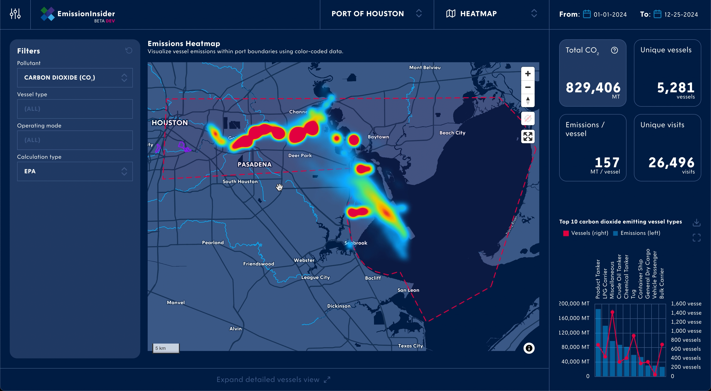

---
# Metadata
title: &title How my first frontend got an award
author: Hamza Haiken
header: *title
footer: From Tableau to Svelte

transition: wipe

# Don't change
marp: true
theme: codestar
paginate: true
math: mathjax
---

# How my first frontend got an award
*From Tableau to Svelte*

---

Scan to follow along or keep the link for later:

*Link to the slides*

---

## Who am I

---

<!-- TODO: Avatar -->

Who am is Hamza Haiken?

- Codestar for 10 years
- Professional backender,
    hobbyist everything else
- [github.com/tenchi2xh](github.com/tenchi2xh)

---

Assignment:

- PortXChange (a Port of Rotterdam startup)
- Maritime domain: scheduling, emissions, etc.
- Codestar kickstarted the project, full-stack
- I joined later for backend and infrastructure

---

## initial setup

---

What's EmissionInsider?

- Calculates all shipping-related emissions within worldwide ports
- Backend pushes calculations to a Postgres database
- Enroll customer ports and deploy a Tableau dashboard as their “frontend”

---

And what's Tableau?

- Data visualization tool for businesses
    - Customers already familiar with it
- Normally used for Business Intelligence
- WYSIWYG editor
- Ecosystem of apps

---

## tableau "app" (& all the drawbacks)

---

<!-- _footer: '' -->
<!-- _header: '' -->
<!-- _paginate: false -->
<!-- _class: invert -->

---

Drawbacks:

- Limited customizations and visualizations
- Editing dashboards is painful
- Very poor performance on heavy database queries
- Need to maintain huge database materialized views

---

<!-- _footer: '' -->
<!-- _header: '' -->
<!-- _paginate: false -->
<!-- _class: invert -->

---

<!-- _header: '' -->

More drawbacks:

- BI dashboards are not supposed to be websites or products
    - Reactivity hard to achieve (and sometimes impossible)
    - Customer's design language absent
    - Slow and clunky
- Total lack of access control

---

<!-- _footer: '' -->
<!-- _header: '' -->
<!-- _paginate: false -->
<!-- _class: invert -->

---

<!-- _footer: '' -->
<!-- _header: '' -->
<!-- _paginate: false -->
<!-- _class: invert -->

More more drawbacks:

- We need environments and different versions for different customers
- No official templating system
    - Exported files are barely human readable 54,000 lines of XML
- Propagating changes in a consistent way is very hard
    - Custom made deployment system
    - Hack, not meant to be used by Tableau
    - Their on-demand servers would completely crash when deploying

---

## we can do better

---

So, what to do now?

- Team has no frontend capacity
    - Initial decision to use Tableau probably
        from fear of slow React development
- Got approval to make my own thing in Svelte
    - Personal experience from hobbies
    - Made a small page previously for them
    - Rapid iterations seen with previous project

---

## why svelte?

---

<!-- _footer: '' -->
<!-- _header: '' -->
<!-- _paginate: false -->
<!-- _class: invert -->

---

Why did I choose Svelte?

- I love to experiment with new things
- It looked so easy and magic
- Top-ranked in the latest *State of JavaScript*

     

---

What's good about Svelte?

- Faster and smaller websites
- Ultra-reactive by design
- Easy to animate by design
- Easy to build custom features
- Easy to maintain
- Better user experience

  

---

The customer uses React

- A lot of boilerplate and ceremony and types
- Our designer knows to expect a two-week wait for new minor features
- React has become bloated over the years

---

# The journey

---

**Milestone 1**: Reach feature parity with Tableau dashboard

- Setting up a new project
- Building components from scratch
- Preserve functionality while improving usability

---

<video autoplay loop muted src="charts.mp4"></video>

---

<!-- _footer: '' -->
<!-- _header: '' -->
<!-- _paginate: false -->
<!-- _class: invert -->

---

**Milestone 2**: Optimize performance

- Tableau could only query databases
- Building a BFF
- Switching from on-demand queries to pre-calculated data on S3

---

<video autoplay loop muted src="loading.mp4"></video>

---

**Milestone 3**: Add real access control

- Integration with existing auth solution
- Workflow integrated within Svelte using plugins

---

<!-- _footer: '' -->
<!-- _header: '' -->
<!-- _paginate: false -->
<!-- _class: invert -->

---

**Milestone 4**: Innovate and improve

- User settings
- Themes
- 3D maps views
- Emissions equivalents comparator
- Report generation

---

<video autoplay loop muted src="3d.mp4"></video>

---

<video autoplay loop muted src="comparator.mp4"></video>

---

<video autoplay loop muted src="settings.mp4"></video>

---

<video autoplay loop muted src="report.mp4"></video>

---

## Awards!

---

<!-- _footer: '' -->
<!-- _header: '' -->
<!-- _paginate: false -->

---

## Customer feedback

---

- Product owner:
    - Roadblocks gone
    - Focus shifted to innovation
- Designer & director of product:
    - Impressed with development cycle speed
    - Easier to experiment with features
- Early end-user feedback (Port of Houston):
    - Positive reception

---

## Lessons learned

---

Early decisions:

* Don't use business tools for client-facing products
* Be open to new technologies;
    Speed and simplicity outweigh keeping your stack

---

Using Svelte:

* Making stuff is so easy and intuitive
* Low effort needed for creating components:
    - Encourages building from scratch, reducing reliance on libraries
* Wrapping vanilla JS libraries is very easy and powerful in Svelte

---

Other:

* Optimize data flows by pre-calculating
* BFFs are nice

---

## Questions time

---

