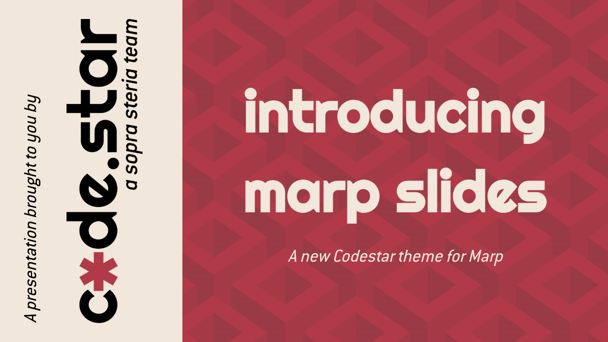

# Codestar theme for Marp 


Two-in-one solution for building and [hosting](https://code-star.github.io/codestar-marp/) our slide decks.



---

Contents:

- [Features](#features)
- [Usage](#usage)
- [Editing guidelines](#editing-guidelines)
- [Development](#development)

---

## Features

- A new design using our new Codestar design language
    - Rotating slide accent colors using the Codestar palette
    - Title cards with brutalist-inspired pure CSS backgrounds
- Syntax highlighting using the Codestar palette, with language labeling
- Multi-column slides
- Automatic builds and hosting
- Slide decks listing

Quick links:
- [Check out the example slide deck here!](https://code-star.github.io/codestar-marp/example/)
- [Listing of all slide decks](https://code-star.github.io/codestar-marp/)

---

## Usage

- Requirements:
    - If you want to write your Markdown in VS Code with a live preview: [Marp for VS Code](https://marketplace.visualstudio.com/items?itemName=marp-team.marp-vscode)
    - Or, if you want to run a live preview server: `npm install -g @marp-team/marp-cli`

- To get started, make a new directory for your slide deck and copy the example sldes (replace `deck-name` with the title of your presentation):

    ```bash
    mkdir decks/deck-name
    cp example.md decks/deck-name/slides.md
    ```

    Extra resource files (for example images) can go in that new folder as well.

- Edit and preview your slides:

    - VS Code: open this repository's folder, edit the new `slides.md` file, and in the top right corner of the editor, click the preview button (or <kbd>⌘ + K, V</kbd>).

    - `marp-cli`: from this repo's root, run `marp -s --theme theme/codestar.css .` to start a live server with a directory listing that you can navigate on http://localhost:8080.

- Make a pull request and merge. GitHub actions will build the slides and serve them on our [decks listing hosted on GH pages](https://code-star.github.io/codestar-marp/).

---

## Editing guidelines

### Metadata

- Make sure to fill all the metadata in the front matter.
- Metadata directives can be changed for a particular slide. For example, if you want a different footer on one slide, include this:

    ```html
    <!-- _footer: This slide has a different footer! -->
    ```

    If you want a slide without a footer or header, add:

    ```html
    <!-- _header: '' -->
    <!-- _footer: '' -->
    ```
### Customization

- Make sure to **update the QR code's link** by replacing `example/` with the name of your slide deck's directory.
- If you prefer a dark theme, uncomment `class: invert` in the front matter.
- Presenter notes can be added using regular HTML comments, and will be visible on each slide when using the presenter mode. To start presenter mode, move the mouse over the presentation and click the right button on the toolbar.

### Other guidelines

- Keep the `div` structure of the title card and the thank you slide intact
- Keep section title cards short, with at most a subtitle.
- The casual tone of some slides can be changed to a more formal toneif preferred (for example, "any questions?" instead of "questions time").
- For reference on other formatting options, slide layouts, slide backgrounds, etc., check out all the slides from `examples.md` (you can also watch that presentation [here](https://code-star.github.io/codestar-marp/example/)).

### Quick reference links:

- [Image syntax](https://marpit.marp.app/image-syntax)
- [Transitions](https://github.com/marp-team/marp-cli/blob/main/docs/bespoke-transitions/README.md#built-in-transitions)
- [Directives](https://marpit.marp.app/directives)
- [Supported emoji codes](https://github.com/markdown-it/markdown-it-emoji/blob/master/lib/data/full.mjs)

---

## Development

Requirements:

- The watch script needs `fswatch` to monitor SCSS changes:

    ```bash
    brew install fswatch
    ```

- Sass is needed for building the styles:

    ```bash
    npm install -g sass
    ```

- And for building the actual slides:

    ```bash
    npm install -g @marp-team/marp-cli
    ```

You can then run `./watch.sh` to watch for changes in any SCSS file to rebuild the main CSS file.

*Note: the output file `theme/codestar.css` is included in version control so that it can be hosted and used directly as a link to GitHub, but it is generated code and not meant for editing.*
